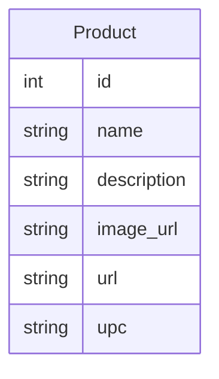

# Cheapify
**An aggregator for aggregators!**

A web application  to aggregate data from various e-commerce websites like amazon, flipkart, snapdeal, etc. and provide the user with the best price for the product they are looking for.

This web application is built using [tooljet](https://github.com/tooljet/tooljet) frontend connected to an elephantdb managed database and python webscraping scripts that scrape websites like amazon, flipkart, etc.. 
#### How do we find the best price?
We store the prices of the product in the database and then sort them in ascending order and return the first price which is the lowest price.

#### How do we aggregate products ?
We can use UPC codes to identify products. We use the [UPCitemdb](https://www.upcitemdb.com/) API to get the UPC code of the product and then use the [Amazon Product Advertising API](https://webservices.amazon.com/paapi5/documentation/) to get the product details.

## Application Design
Our application is divided into 3 parts:
1. The webscraping scripts built using python and [flask](https://flask.palletsprojects.com/en/2.0.x/) 
2. The database built using [elephantdb]( https://www.elephantsql.com/docs/index.html) and postgresql 
3. The frontend built using [tooljet](github.com/tooljet/tooljet)

## Web Scraping
### Current Approach
Build a python script that uses the html_requests library to make HTTP requests to the websites and the BeautifulSoup library to parse the HTML content of the websites. We can then use the parsed HTML content to extract the data we need. We can then store the data in the database.

### 1st Approach
We have used python and flask to build the webscraping scripts. We have used the [requests](https://docs.python-requests.org/en/master/) library to make HTTP requests to the websites and the [BeautifulSoup](https://www.crummy.com/software/BeautifulSoup/bs4/doc/) library to parse the HTML content of the websites.

##### Cons
1. Unable to get the webpage it gets only the header and footer of a given page.
2. Since the content is unavailable this approach is rendered useless.
### 2nd Approach
We have used the autoscraper library to scrape the data from the websites. This library is built on top of the BeautifulSoup library and uses the same to scrape the data. This library is very easy to use and is very fast. It can scrape data from any website and can be used to scrape data from dynamic websites as well.

##### Cons
1. Un reliable 
2. Unable to group the data into objects to be stored in the database

## Database
### Current Approach
We have used the elephantdb database to store the data. We have used the postgresql database to store the data. We have used the [elephantdb]( https://www.elephantsql.com/docs/index.html) to manage the database. We have used the [psycopg2](https://pypi.org/project/psycopg2/) library to connect to the database and perform operations on the database.
### 1st Approach
Used postgresql locally to store the data. Used the [psycopg2](https://pypi.org/project/psycopg2/) library to connect to the database and perform operations on the database.
#### Cons
1. Unable to access the database from anywhere.
2. Unable to share the database with other team members.
### Database Schema

## User Interface
### Current Approach
Using the [tooljet](github.com/tooljet/tooljet) to build the frontend. Tooljet is a low-code platform for building web applications. It is built using [react](https://reactjs.org/) and [typescript](https://www.typescriptlang.org/). It is a very easy to use platform and can be used to build web applications very quickly. It is also very easy to integrate with other services like databases, APIs, etc. It is also very easy to deploy the application. It can be deployed using the tooljet-cli.

- [click here for the live demo](https://app.tooljet.com/applications/Cheapify)
#### Cons:
1. Unable to scale up
2. Unable to integrate with other services
### 1st Approach
using flask to build the frontend. Flask is a micro web framework written in python. It is very easy to use and can be used to build web applications very quickly. It is also very easy to integrate with other services like databases, APIs, etc. It is also very easy to deploy the application. It can be deployed using the [gunicorn](https://gunicorn.org/) server.
#### Cons:
1. Takes too long to build the web application

## Future Work
1. Use the [Amazon Product Advertising API](https://webservices.amazon.com/paapi5/documentation/) to get the product details.

2. Use the [UPCitemdb](https://www.upcitemdb.com/) API to get the UPC code of the product.

3. Store time stamps to get the price history of the product. this helps in historic monitoring of the product price.

## Contributors
1. [Mashhood Alam](www.github.com/MASHOD0)
1. [M Sai Santosh](https://github.com/SaiSantosh2209)
1. [Ridda Malik](https://github.com/rida228)
1. [Mamoon Shakeel](www.github.com/MamoonShakeel)
